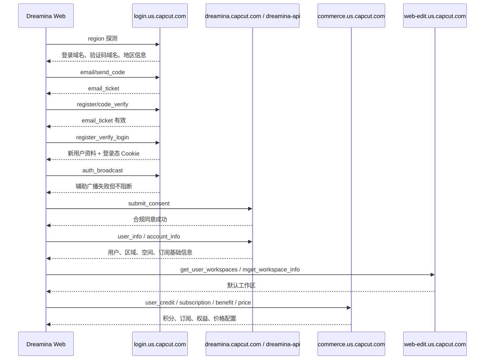

# Dreamina / CapCut 注册流程抓包业务分析

## 1. 分析对象

- 抓包文件：`capture-2026-05-08T07-36-50.json`
- 目标页面：`https://dreamina.capcut.com/ai-tool/home`
- 抓包时间范围：`2026-05-08T07:34:30Z` 至 `2026-05-08T07:35:54Z`
- 请求总数：517 条
- 主业务：邮箱验证码注册、自动登录、合规同意、用户初始化、工作区初始化、权益与价格初始化

> 说明：本文只保留业务结构。邮箱、验证码、密码、cookie、session、token、签名参数、用户 ID、设备指纹等敏感值均已脱敏，不输出原始值。

## 2. 请求整体分布

### 2.1 主要域名

| 域名 | 请求数 | 业务角色 |
|---|---:|---|
| `sf16-web-tos-buz.capcutcdn-us.com` | 249 | 前端 JS/CSS/静态资源 |
| `dreamina-api.us.capcut.com` | 52 | Dreamina 主业务 API |
| `p16-dreamina-sign-useast5.capcutcdn-us.com` | 49 | 图片/模型素材 CDN |
| `commerce.us.capcut.com` | 28 | 订阅、积分、权益、价格 |
| `mcs16-normal-us-ttp.capcutapi.us` | 23 | 行为埋点 |
| `mon16-normal-us-ttp.capcutapi.us` | 13 | 监控上报 |
| `login.us.capcut.com` | 12 | 注册、验证码、登录态 |
| `dreamina.capcut.com` | 9 | 页面、账号信息、合规接口 |
| `web-edit.us.capcut.com` | 6 | 工作区/空间信息 |
| `login-row.www.capcut.com` | 4 | 登录区域探测/广播辅助域 |

### 2.2 状态码概览

| 状态码 | 数量 | 说明 |
|---|---:|---|
| 200 | 433 | 大部分业务请求成功 |
| 204 | 60 | CORS 预检、监控/埋点无内容响应 |
| 304 | 5 | 缓存命中 |
| 307 | 1 | 注册验证码校验接口补尾斜杠重定向 |
| 302 | 1 | 退出登录后跳转 |
| 405 | 2 | `dreamina-api` 工作区接口 OPTIONS 预检异常 |
| 404 | 2 | 活动资源接口缺失或不可用 |
| 0 | 13 | 被取消、跨域失败、ping/image 无完整响应等 |

## 3. 业务阶段总览

本次抓包可以拆成 7 个业务阶段：

1. 页面已有环境下的埋点和监控上报
2. 登录区域/风控环境探测
3. 邮箱发送验证码
4. 验证邮箱验证码
5. 注册并完成登录
6. 登录态广播、合规确认、用户信息落库
7. 登录后初始化 Dreamina 工作台、权益、订阅、价格、素材与配置



## 4. 注册主链路

### 4.1 区域和登录域名探测

| 时间 | 方法 | 接口 | 状态 | 作用 |
|---|---|---|---:|---|
| 07:34:49.630 | POST | `login-row.www.capcut.com/passport/web/region/` | 200 | 辅助区域探测 |
| 07:34:49.631 | POST | `login.us.capcut.com/passport/web/region/` | 200 | 主区域探测 |

请求特征：

- Query 包含 `aid=513641`、`account_sdk_source=web`、`sdk_version=2.1.10-tiktok`、`language=en`、`verifyFp`、`mix_mode=1`
- Body 是表单格式，主要字段包括：
  - `type`
  - `hashed_id`

响应业务含义：

- 返回登录主域名：`https://login.us.capcut.com`
- 返回验证码域名：`rc-verification-sg.tiktokv.com`
- 返回国家/地区码
- `login.us.capcut.com` 额外返回 `ttwid_migration_ticket`

结论：

该阶段用于确认用户所在区域、选择登录服务域名、初始化验证码/风控相关配置。

### 4.2 邮箱发送验证码

| 时间 | 方法 | 接口 | 状态 | 作用 |
|---|---|---|---:|---|
| 07:34:54.296 | POST | `login.us.capcut.com/passport/web/email/send_code/` | 200 | 发送注册邮箱验证码 |

请求 Body 结构：

| 字段 | 含义 |
|---|---|
| `mix_mode` | 混合登录/注册模式 |
| `email` | 注册邮箱，已脱敏 |
| `password` | 注册密码，已脱敏 |
| `type` | 邮箱验证码业务类型 |
| `fixed_mix_mode` | 固定混合模式标记 |

响应结构：

| 字段 | 含义 |
|---|---|
| `data.email` | 目标邮箱，已脱敏 |
| `data.email_ticket` | 邮箱验证码流程票据，已脱敏 |
| `message=success` | 发送成功 |

结论：

服务端在发码阶段已经接收邮箱和密码，并返回 `email_ticket` 作为后续验证码校验/注册登录的临时凭证。

### 4.3 邮箱验证码校验

| 时间 | 方法 | 接口 | 状态 | 作用 |
|---|---|---|---:|---|
| 07:35:27.609 | POST | `login.us.capcut.com/passport/web/email/register/code_verify` | 307 | 重定向到尾斜杠版本 |
| 07:35:28.230 | POST | `login.us.capcut.com/passport/web/email/register/code_verify/` | 200 | 校验邮箱验证码 |

请求 Body 结构：

| 字段 | 含义 |
|---|---|
| `mix_mode` | 混合模式 |
| `email` | 注册邮箱，已脱敏 |
| `code` | 邮箱验证码，已脱敏 |
| `type` | 验证码业务类型 |
| `fixed_mix_mode` | 固定混合模式标记 |

响应结构：

| 字段 | 含义 |
|---|---|
| `data.email_ticket` | 校验后的邮箱票据，已脱敏 |
| `message=success` | 验证码校验成功 |

结论：

`code_verify` 不是最终注册接口，它只确认验证码有效，并换取/确认 `email_ticket`。未带尾斜杠的 URL 会被 307 到带尾斜杠版本。

### 4.4 注册并自动登录

| 时间 | 方法 | 接口 | 状态 | 作用 |
|---|---|---|---:|---|
| 07:35:35.365 | POST | `login.us.capcut.com/passport/web/email/register_verify_login/` | 200 | 注册账号并建立登录态 |

Query 特征：

- 基础参数：`aid`、`account_sdk_source`、`sdk_version`、`language`、`verifyFp`
- 风控/签名参数：`msToken`、`X-Bogus`、`X-Gnarly`

请求 Body 结构：

| 字段 | 含义 |
|---|---|
| `email` | 注册邮箱，已脱敏 |
| `code` | 邮箱验证码，已脱敏 |
| `password` | 注册密码，已脱敏 |
| `email_ticket` | 邮箱验证票据，已脱敏 |
| `birthday` | 生日/年龄门槛字段 |
| `force_user_region` | 强制用户区域，本次为美国区域 |
| `biz_param` | 业务扩展参数 |
| `mix_mode` / `fixed_mix_mode` / `type` | 登录 SDK 模式参数 |

响应核心字段：

| 字段 | 含义 |
|---|---|
| `data.app_id` | 应用 ID，513641 |
| `data.user_id` / `user_id_str` | 新用户 ID，已脱敏 |
| `data.name` / `screen_name` | 默认用户名 |
| `data.avatar_url` | 默认头像 |
| `data.email_collected=true` | 已收集邮箱 |
| `data.phone_collected=false` | 未绑定手机号 |
| `data.new_user=1` | 新用户标识 |
| `data.has_password=0` | 注册响应里显示密码状态待后续账号信息刷新 |
| `data.sec_user_id` | 安全用户 ID，已脱敏 |
| `message=success` | 注册登录成功 |

结论：

这是主注册提交接口。成功后服务端返回新用户资料，并通过响应头建立登录态 Cookie。后续业务接口已经能读取到该登录态。

## 5. 登录态同步与合规确认

### 5.1 登录态广播

| 时间 | 方法 | 接口 | 状态 | 作用 |
|---|---|---|---:|---|
| 07:35:36.369 | POST | `login-row.www.capcut.com/passport/web/auth_broadcast/` | 200 | 跨域登录态广播辅助 |
| 07:35:36.370 | POST | `login.us.capcut.com/passport/web/auth_broadcast/` | 200 | 登录态广播 |

请求 Body 包含：

- `hashed_id`
- `sec_uid`
- `screen_name`
- `pre_path`
- `final_domain`
- `is_retry`

响应结果：

- `message=error`
- `error_code=16`
- `description=Application has no permissions`

结论：

该广播接口返回业务错误，但后续用户信息、工作区、权益接口均成功，因此它不是本次注册成功的阻断条件。更像是登录 SDK 对多域同步的辅助尝试。

### 5.2 合规弹窗同意

| 时间 | 方法 | 接口 | 状态 | 作用 |
|---|---|---|---:|---|
| 07:35:37.571 | POST | `dreamina.capcut.com/lv/v1/sc/compliance_popup/submit_consent` | 200 | 提交条款/隐私同意 |
| 07:35:39.011 | POST | `dreamina.capcut.com/lv/v1/sc/compliance_popup/submit_consent` | 200 | 重复提交/确认 |

请求 Body：

```json
{
  "entity_key": "conditions-policy-privacy-policy",
  "business_flow": "web_login",
  "consent_status": "approved",
  "region": "US"
}
```

响应：

- `ret=0`
- `errmsg=success`

结论：

注册登录后，Dreamina 会要求记录条款和隐私政策同意状态。该接口属于登录后合规闭环。

### 5.3 Dreamina 用户信息初始化

| 时间 | 方法 | 接口 | 状态 | 作用 |
|---|---|---|---:|---|
| 07:35:37.576 | POST | `dreamina.capcut.com/lv/v1/user/web/user_info` | 200 | 写入/获取 Dreamina Web 用户资料 |
| 07:35:39.395 | GET | `dreamina.capcut.com/passport/web/account/info/` | 200 | 获取 Passport 账号信息 |
| 07:35:39.395 | GET | `dreamina.capcut.com/passport/web/account/info/` | 200 | 重复账号信息查询 |
| 07:35:50.112 | GET | `dreamina.capcut.com/passport/web/account/info/` | 200 | 后续账号信息刷新 |

`user_info` 请求 Body：

```json
{
  "sem_info": {
    "is_sem": false,
    "medium": "Direct",
    "register_source": "direct",
    "register_second_source": "[REDACTED]"
  }
}
```

`user_info` 响应核心数据：

| 字段 | 含义 |
|---|---|
| `updated_sem=true` | SEM 来源信息更新成功 |
| `user_info.user_id` | Dreamina 用户 ID，已脱敏 |
| `user_info.nick_name` | 默认昵称 |
| `user_info.email` / `bind_email` | 绑定邮箱，已脱敏 |
| `user_info.register_source=direct` | 注册来源为直接访问 |
| `user_info.create_time` | 用户创建时间 |
| `user_info.has_birthday=true` | 已设置生日/年龄门槛 |
| `location.domain.web_domain` | Web 编辑域：`https://web-edit.us.capcut.com` |
| `location.domain.commerce_domain` | 商业化域：`https://commerce.us.capcut.com` |
| `ever_photo.token` | 空间/媒体相关 token，已脱敏 |
| `space_info.workspace_id` | 默认工作区 ID，已脱敏 |
| `subscribe_info.flag=false` | 当前非订阅用户 |

`account_info` 响应核心数据：

| 字段 | 含义 |
|---|---|
| `has_password=1` | 账号已具备密码 |
| `session_key` | 会话 key，已脱敏 |
| `biz_target_idc=useast5` | 业务目标机房 |
| `app_id=513641` | Dreamina/CapCut Web 应用 ID |

结论：

注册成功后，平台会同时维护 Passport 账号资料和 Dreamina 业务侧用户资料。Dreamina 业务侧会补充注册来源、年龄、区域、空间、订阅等信息。

## 6. 登录后工作台初始化

### 6.1 工作区与空间

| 时间 | 方法 | 接口 | 状态 | 作用 |
|---|---|---|---:|---|
| 07:35:39.398 | POST | `web-edit.us.capcut.com/cc/v1/workspace/get_user_workspaces` | 200 | 获取用户工作区列表 |
| 07:35:39.407 | POST | `web-edit.us.capcut.com/cc/v1/workspace/mget_workspace_info` | 200 | 批量获取工作区详情 |
| 07:35:39.408 | POST | `web-edit.us.capcut.com/cc/v1/workspace/get_all_everphoto_user` | 200 | 获取空间/媒体相关用户 |
| 07:35:39.410 | POST | `dreamina-api.us.capcut.com/cc/v1/workspace/get_user_workspaces` | 0 | 请求失败 |
| 07:35:39.412 | OPTIONS | `dreamina-api.us.capcut.com/cc/v1/workspace/get_user_workspaces` | 405 | 预检不支持 |

结论：

工作区数据最终由 `web-edit.us.capcut.com` 成功返回。`dreamina-api.us.capcut.com` 上同名工作区接口的 CORS 预检返回 405，前端随后依赖 `web-edit` 域完成工作区初始化。

### 6.2 Dreamina 功能配置

| 接口 | 作用 |
|---|---|
| `POST /mweb/v1/get_common_config` | 获取图像/视频模型、生成配置、商业化配置 |
| `POST /mweb/v1/creation_agent/v2/get_agent_config` | 获取创作 Agent 图像/视频配置 |
| `POST /mweb/v1/video_generate/get_common_config` | 获取视频生成配置 |
| `POST /mweb/v1/get_experiment_params` | 获取实验/AB 参数 |
| `POST /mweb/v1/feature_permission` | 查询功能权限白名单/开放状态 |
| `POST /lv/v1/user/get_enable_list` | 查询用户启用能力列表 |

关键观察：

- `get_common_config` 返回模型列表，包含图像模型、默认模型、移动端可用模型、商业化扣费规则等。
- `creation_agent/v2/get_agent_config` 同时返回图像 Agent 和视频 Agent 配置。
- `feature_permission` 一次性查询约 28 个功能 key，响应里返回功能状态、白名单、邀请状态等。
- `get_experiment_params` 返回多个 Dreamina 实验参数，例如模型配置、会员优先级、高清商业化配置等。

结论：

登录后页面不是只拉用户信息，而是并行拉取模型能力、实验参数、权限配置和商业化规则，用于决定首页/生成页展示哪些入口、模型和付费限制。

### 6.3 用户资产与通知

| 接口 | 作用 | 本次结果 |
|---|---|---|
| `POST /mweb/v1/get_asset_list` | 获取工作台资产列表 | 空列表 |
| `POST /mweb/v1/infinite_canvas/list_project` | 获取无限画布项目 | 空列表 |
| `POST /mweb/v1/get_unread_count` | 获取通知未读数 | 类型 1、2 均为 0 |
| `POST /mweb/v1/get_image_by_uri` | 将内部 URI 转成 CDN 图片 URL | 成功返回图片 URL |
| `POST /mweb/v1/feed` | 首页 Feed/模板流 | 后续页面展示请求 |

结论：

新注册用户没有历史资产和项目。首页依赖 `feed`、`get_image_by_uri` 和 CDN 图片请求渲染初始内容。

## 7. 商业化与权益初始化

### 7.1 订阅状态

| 时间 | 方法 | 接口 | 状态 | 作用 |
|---|---|---|---:|---|
| 07:35:39.410 | POST | `commerce.us.capcut.com/commerce/v1/subscription/user_info` | 200 | 查询订阅状态 |

请求：

```json
{
  "aid": 513641,
  "scene": "vip",
  "need_sign_info": true
}
```

响应核心结论：

- `flag=false`：当前没有有效订阅
- `is_first_subscribe=true`：首次订阅用户
- `can_free_trial=false`：不可用免费试用
- `workspace_subscribe_info.flag=false`：工作区无有效 VIP

### 7.2 积分与积分历史

| 接口 | 作用 | 本次结果 |
|---|---|---|
| `POST /commerce/v1/benefits/user_credit` | 查询当前积分 | VIP/Gift/Purchase 均为 0 |
| `POST /commerce/v1/benefits/user_credit_history` | 查询积分流水 | 空记录，总积分 0 |
| `POST /commerce/v1/benefits/credit_receive` | 尝试领取积分 | 被风控拒绝 |

`credit_receive` 响应：

- `ret=-4`
- `errmsg=shark action check reject`
- `receive_quota=0`
- `has_popup=false`

结论：

注册后系统尝试触发积分领取或礼包检测，但本次被风控策略拒绝，没有发放积分。

### 7.3 权益元数据与用户权益

| 接口 | 作用 |
|---|---|
| `POST /commerce/v3/resource/benefit_metadata` | 查询资源权益元数据 |
| `POST /commerce/v3/benefits/batch_get_user_benefit` | 批量查询用户对资源的可用权益 |
| `POST /lv/v1/commerce/get_entrances` | 获取 VIP/SVIP 入口开关 |
| `POST /commerce/v1/common/start_up` | 商业化启动配置 |

关键观察：

- `get_entrances` 返回 VIP/SVIP 入口可用状态。
- `benefit_metadata` 查询 `aigc`、`credit` 等资源的权益策略。
- `batch_get_user_benefit` 返回约 76 项权益资产，用于判断生成、导出、水印、高清等能力是否受限。
- `common/start_up` 返回水印、云空间、订阅引导、实验分组等商业化配置。

### 7.4 价格列表

| 接口 | 作用 |
|---|---|
| `POST /commerce/v1/purchase/price_list` | 查询积分充值价格 |
| `POST /commerce/v1/subscription/cc_price_list` | 查询会员订阅价格 |

本次价格配置：

- 积分充值商品类型：`credit`
- 订阅场景：`vip`
- 月订阅示例：`dreamina.standard.monthly_new`，展示价格 `$15.00/Monthly`
- 年订阅示例：`dreamina.standard.yearly_new`，展示价格 `$145.00/Yearly`
- 价格响应中包含 SKU、订阅周期、权益文案、容量、续费信息等

结论：

登录后商业化模块立即初始化，便于首页或生成页展示会员入口、积分余额、权益限制和付费价格。

## 8. 埋点、监控与第三方统计

本次抓包里有大量非主业务请求：

| 域名/接口 | 类型 | 说明 |
|---|---|---|
| `mcs16-normal-us-ttp.capcutapi.us/list` | 行为埋点 | 页面停留、按钮点击、注册状态、模板展示等 |
| `mon16-normal-us-ttp.capcutapi.us/monitor_browser/collect/batch/` | 性能/异常监控 | 浏览器监控批量上报 |
| `vmweb16-normal-us-ttp.capcutapi.us/service/2/abtest_config/` | AB 实验 | 获取实验配置 |
| `www.google-analytics.com/g/collect` | 第三方统计 | GA 页面和事件统计 |
| `bat.bing.com/action` | 第三方统计 | Bing 广告/行为统计 |
| `mssdk.capcutapi.us/web/report` | 安全/设备环境上报 | Web 安全 SDK 上报 |

这些请求对注册主链路不是强依赖，但用于统计、风控、AB 实验和页面监控。

## 9. 异常与可关注点

### 9.1 `auth_broadcast` 返回权限错误

- 接口：`/passport/web/auth_broadcast/`
- 返回：`Application has no permissions`
- 影响：不阻断注册和后续登录态使用
- 推测：登录 SDK 跨域广播辅助失败，主登录态已通过 Cookie 或主域接口建立

### 9.2 工作区接口预检异常

- 接口：`dreamina-api.us.capcut.com/cc/v1/workspace/get_user_workspaces`
- OPTIONS 返回：405
- POST 记录状态：0
- 影响：不阻断，因为 `web-edit.us.capcut.com` 上的工作区接口成功
- 推测：前端存在多域候选或兼容调用，失败后使用可用域

### 9.3 积分领取被风控拒绝

- 接口：`/commerce/v1/benefits/credit_receive`
- 返回：`ret=-4`，`shark action check reject`
- 影响：不影响注册，但没有获得可领取积分
- 推测：商业化/风控系统对新账号领取动作做了限制

### 9.4 退出登录与重新加载首页

抓包后段出现：

| 时间 | 方法 | 接口 | 状态 |
|---|---|---|---:|
| 07:35:54.013 | GET | `dreamina.capcut.com/passport/web/logout/` | 302 |
| 07:35:54.388 | GET | `dreamina.capcut.com/ai-tool/home` | 200 |

说明用户或页面触发了退出登录，然后跳回首页。该动作发生在注册和初始化之后，不属于注册必要步骤。

## 10. 业务流程结论

本次 Dreamina 注册流程的核心业务链路如下：

1. 前端初始化登录 SDK，并通过 `region` 接口确认地区、登录域和验证码域。
2. 用户输入邮箱和密码后，请求 `email/send_code` 发送邮箱验证码。
3. 用户提交验证码后，请求 `email/register/code_verify/` 校验验证码并确认 `email_ticket`。
4. 前端携带邮箱、验证码、密码、`email_ticket`、生日、区域和风控签名参数，请求 `email/register_verify_login/`。
5. 服务端创建新账号并返回用户资料，同时建立登录态。
6. 前端尝试 `auth_broadcast` 做登录态广播，虽然返回权限错误，但不阻断。
7. Dreamina 业务侧提交条款/隐私同意，并调用 `user/web/user_info` 初始化业务用户资料、区域、空间和订阅基础状态。
8. 页面并行拉取账号信息、工作区、模型配置、实验参数、功能权限、资产列表、通知数。
9. 商业化模块拉取积分、订阅、权益、价格和启动配置，判断新用户可用权益、付费入口和生成限制。
10. 新注册账号最终进入 Dreamina 工作台/生成页初始化状态。

## 11. 可复用的业务模型

```text
注册入口
  -> 区域/风控初始化
  -> 邮箱发码
  -> 邮箱验证码校验
  -> 注册并登录
  -> 登录态同步
  -> 合规同意
  -> 用户资料初始化
  -> 工作区初始化
  -> 功能/模型配置初始化
  -> 商业化权益初始化
  -> 首页/生成页内容加载
```

## 12. 敏感字段清单

以下字段在分析中应始终脱敏或避免落盘传播：

- 账号类：`email`、`password`、`code`、`birthday`
- 登录态类：`Cookie`、`session_key`、`passport_csrf_token`、`sid_guard`、`uid_tt` 等
- 票据类：`email_ticket`、`ttwid_migration_ticket`
- 风控签名类：`verifyFp`、`msToken`、`X-Bogus`、`X-Gnarly`
- 用户标识类：`user_id`、`user_id_str`、`sec_user_id`、`web_id`、`workspace_id`
- 媒体/空间凭据：`ever_photo.token`
- 响应签名类：`sign`、`response` 中的签名包

## 13. 后续分析建议

- 如果要区分“注册必要请求”和“登录后页面初始化请求”，建议按时间切割：`register_verify_login` 成功之前为注册链路，之后为初始化链路。
- 如果要做接口文档，可基于本文的关键接口继续输出 OpenAPI 风格的字段结构，但仍应保持敏感值脱敏。
- 如果要排查失败注册，重点关注 `email/send_code`、`code_verify`、`register_verify_login` 三个接口的 `message`、错误码和验证码/风控相关响应。
